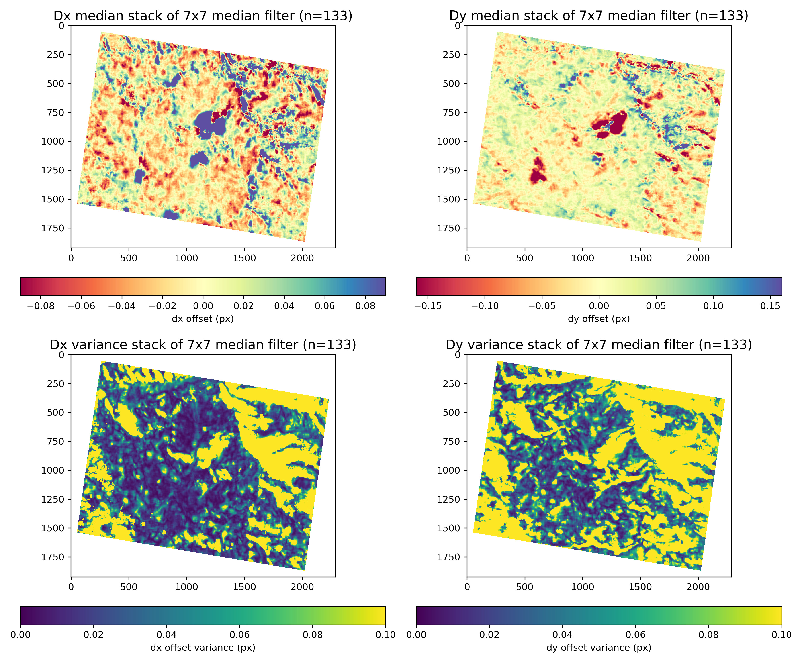
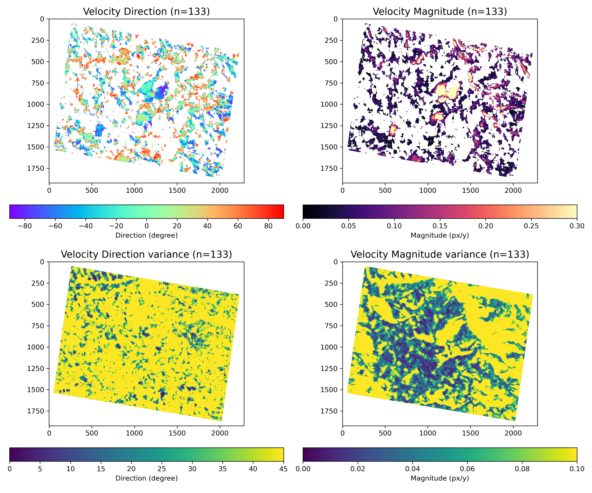
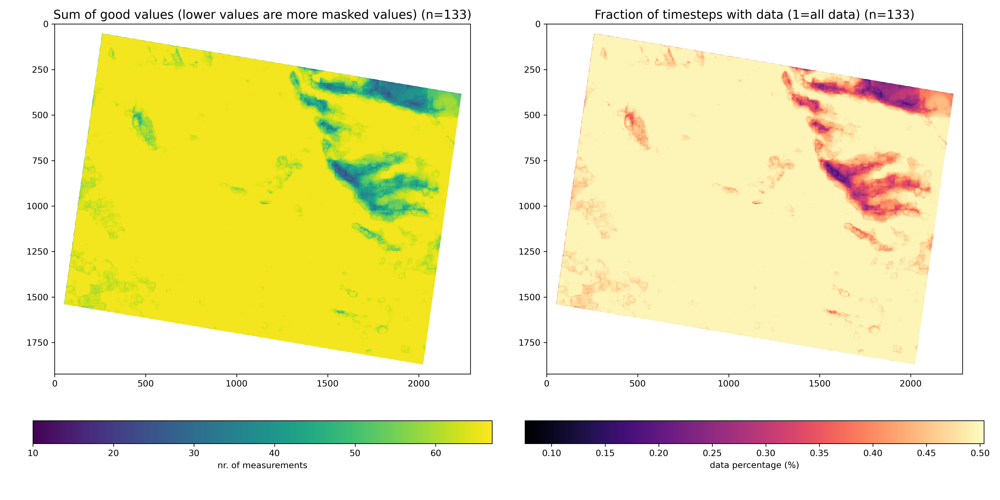
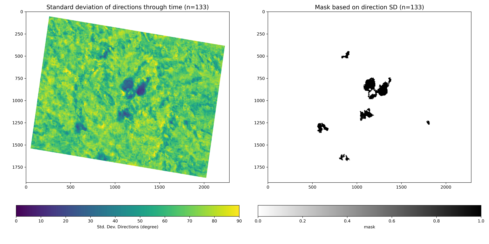

# Prepare files from offset calculation for MintPy processing"
Authors: **Ariane Mueting** and **Bodo Bookhagen**

# Setup Computing Environment
The steps described below depend on mintpy and other packages. These can be installed with conda:
```bash
conda create -n mintpy
conda activate mintpy
conda install -c conda-forge mintpy
```
See also: [https://mintpy.readthedocs.io/en/latest/installation/](https://mintpy.readthedocs.io/en/latest/installation/)

Additional packages are required for faster processing and calculating the confidence values:
```bash
conda activate mintpy
conda install pandas tqdm numba pytables rasterio -c conda-forge
```

and a package via pip:
```bash
pip install install numba-progress
```

You will need to set the PATH to the directory containing the python files for computing the confidence intervals:
```bash
export PYTHONPATH=$PYTHONPATH:/home/bodo/Dropbox/soft/github/Planet2MintPy
```

# Preparing dx, dy offset files from AMES for use with Mintpy

## Create confidence (uncertainties, weights) from offset values

We generate confidence and mask value from the input offset files. 

There exist several approaches and philosophies to calculate uncertainties (or weights or confidences)
from image-correlation data. Here, we have implemented the following methods:

*Method 1 (Useful for PlanetScope or other well-behaved datasets)*
1. Perform a 2D median filter with kernel_size=9 (variable) for each time step separately. This smoothes each timestep.
2. Take the median of all time steps to obtain an averaged value for each pixel.
3. Calculate the angle difference between this averaged value and each time step (x and y offset). Take the cosine of the angle difference to obtain a value between 0 and 1. All angle differences larger than 90 degree will be set to 0.
4. This will result in a pixel-based confidence value (or weight) - but the same value for x and y offsets.
5. Output a mask file with pixels for each time step that have been flagged as: nan by the correation and 0 confidence value (angle difference above 90 degree). This is different for each time step.


*Method 2 (Useful for PlanetScope or other well-behaved datasets)*
1. Calculate the std. deviation of all directions through time.
2. If std. deviation is larger than 45 degree (or a threshold angle), the terrain is not considered a landslide and masked out. This is useful for creating a mask of stable terrain.
3. For the unstable terrain (i.e., landslides), calculate the angle difference between time-averaged averaged value and value at each time step. Take the cosine of the angle difference to obtain a value between 0 and 1. All angle differences larger than 90 degree will be set to 0.
4. Create a mask that shows all unstable terrain (same mask for all time steps).


*Method 3 (Useful for noisy offsets such as derived from Landsat and Sentinel 2)*
1. Perform a 2D median filter with kernel_size=9 (variable) for each time step separately. This smoothes each timestep.
2. Calculate angle difference between aspect direction derived from a DEM and offset direction. If larger than 45 degree (or a threshold value), the pixel and timestep receives 0 weight. Otherwise, the cosine of 2 * the angle difference is assigned as weight.

Using method 1:
```bash
python /home/bodo/Dropbox/soft/github/Planet2MintPy/create_offset_confidence.py \
    --method 1 \
    --kernel_size 9 \
    --threshold_angle 45 \
    --threshold_size 1000 \
    --offset_tif_fn "disparity_maps/*_polyfit-F.tif" \
    --area_name aoi3 \
    --npy_out_path npy \
    --confidence_tif_out_path confidence \
    --sensor PS2
```

Several output PNG files are generated that provide useful information on the confidence calculations, masking, and statistics:










## Prepare Metadata file for MintPy
```bash
python /home/bodo/Dropbox/soft/github/Planet2MintPy/prep_Planet_metadata.py \
  --offset_tif_fn "disparity_maps/*_polyfit-F.tif" \
  --dx_confidence_tif_fn "confidence/*_confidence.tif" \
  --dy_confidence_tif_fn "confidence/*_confidence.tif" \
  --mask_tif_fn "confidence/*_mask.tif" \
  --metadata_fn PS2_aoi3_metadata.txt --processor PS2
```

## Create Config file for MintPy import
Importing data into the MintPy HDF5 relies on a config file. There are many options to be set, but usually you only need to set the proper metadata file and directories with data. We do this by using a template file and modifying the respective parameters. We store this in a new directory `mintpy`.

```bash
mkdir mintpy
sed -e 's#METAFILE_FN#/raid/Planet_NWArg/PS2_aoi3/PS2_aoi3_metadata.txt#' \
  -e 's#azOffFile_FN#/raid/Planet_NWArg/PS2_aoi3/disparity_maps/*-F_EW.vrt#' \
  -e 's#rgOffFile_FN#/raid/Planet_NWArg/PS2_aoi3/disparity_maps/*-F_NS.vrt#' \
  -e 's#azOffStdFile_FN#/raid/Planet_NWArg/PS2_aoi3/confidence/*_confidence.tif#' \
  -e 's#rgOffStdFile_FN#/raid/Planet_NWArg/PS2_aoi3/confidence/*_confidence.tif#' \
  -e 's#mask_FN#/raid/Planet_NWArg/PS2_aoi3/confidence/*_mask.tif#' \
  /home/bodo/Dropbox/soft/github/Planet2MintPy/PS2_Mintpy_template.cfg \
  >/raid/Planet_NWArg/PS2_aoi3/mintpy/PS2_aoi3_config.cfg
```

## Prepare HDF5 stack from PlanetScope data
```bash
python /home/bodo/Dropbox/soft/github/Planet2MintPy/prep_Planet_stack.py \
          --dx_fn "/raid/Planet_NWArg/PS2_aoi3/disparity_maps/*-F_EW.vrt" \
          --dy_fn "/raid/Planet_NWArg/PS2_aoi3/disparity_maps/*-F_NS.vrt" \
          --dx_confidence_fn "/raid/Planet_NWArg/PS2_aoi3/confidence/*_confidence.tif" \
          --dy_confidence_fn "/raid/Planet_NWArg/PS2_aoi3/confidence/*_confidence.tif" \
          --mask_fn "/raid/Planet_NWArg/PS2_aoi3/cconfidence/*_mask.tif" \
          --meta_file /raid/Planet_NWArg/PS2_aoi3/PS2_aoi3_metadata.txt --pixel_size 3.0 \
          --template_file /raid/Planet_NWArg/PS2_aoi3/mintpy/PS2_aoi3_config.cfg \
          --h5_stack_fn /raid/Planet_NWArg/PS2_aoi3/mintpy/inputs/geo_offsetStack_aoi3.h5
```

# SBAS Inversion with Mintpy
set `-w no` for no weights

## Inversion with var and Std
We define a mask data (`--md`) using the mask stored in *offsetSNR* and all values less than 0.5 (`--mt 0.5`) are ignored (or set to NaN). Because this is a boolean dataset with 0 and 1, only values with 1 are considered.

An alternative way to mask data is to define the a threshold on the *OffsetStd*.

We use the weights or confidence values (between 0 and 1) and calculate 1/weight as weights.

```bash
cd raid/PS2_aoi3/mintpy/
ifgram_inversion.py /raid/Planet_NWArg/PS2_aoi3/mintpy/inputs/geo_offsetStack_aoi3.h5 \
    --skip-reference -i azimuthOffset -w var --md offsetSNR --mt 0.5 -c local --num-worker 20 --mem 16 -o timeseriesAz_var.h5 residualInvAz_var.h5 numInvOffsetAz_var.h5
ifgram_inversion.py /raid/Planet_NWArg/PS2_aoi3/mintpy/inputs/geo_offsetStack_aoi3.h5 \
    --skip-reference -i rangeOffset -w var --md offsetSNR --mt 0.5 -c local --num-worker 20 --mem 16 -o timeseriesRg_var.h5 residualInvRg_var.h5 numInvOffsetRg_var.h5
```

Display all time steps
```bash
view.py timeseriesAz_var.h5 --nodisplay --vlim -2 2 -u m --title "PS2 var: Az (NS) timeseries" -c RdYlBu --save -o PS2_ts_NS_var.png
view.py timeseriesRg_var.h5 --nodisplay --vlim -2 2 -u m --title "PS2 var: Rg (EW) timeseries" -c RdYlBu --save -o PS2_ts_EW_var.png
convert -quality 50 PS2_ts_NS_var.png /home/bodo/Dropbox/Argentina/aoi3/PS2_aoi3_ts_NS_var.jpg
convert -quality 50 PS2_ts_EW_var.png /home/bodo/Dropbox/Argentina/aoi3/PS2_aoi3_ts_EW_var.jpg
```

## Calculate average (mean linear) velocity
```bash
timeseries2velocity.py --ref-yx 100 50 timeseriesAz_var.h5 -o velocityAz_var.h5
timeseries2velocity.py --ref-yx 100 50 timeseriesRg_var.h5 -o velocityRg_var.h5
```

View Mean Velocity in Azimuth (N-S) and Range (E-W) directions:
```bash
view.py velocityAz_var.h5 velocity --nodisplay --title "PS2 var: Mean Velocity Az (NS)" --zero-mask -u meters --vlim -1 1 -c RdYlBu --save -o PS2_NS_var_nomask_meanv.png
view.py velocityAz_var.h5 --nodisplay --title "PS2 var: Stats Az (NS)" --zero-mask -u meters --vlim -1 1 -c RdYlBu --save -o PS2_NS_var_nomask_stats.png
convert -quality 50 PS2_NS_var_nomask_meanv.png /home/bodo/Dropbox/Argentina/aoi3/PS2_aoi3_NS_var_nomask_meanv.jpg
convert -quality 50 PS2_NS_var_nomask_stats.png /home/bodo/Dropbox/Argentina/aoi3/PS2_aoi3_NS_var_nomask_stats.jpg

view.py velocityRg_var.h5 velocity --nodisplay --title "PS2 var: Mean Velocity Rg (EW)" --zero-mask -u meters --vlim -1 1 -c RdYlBu --save -o PS2_EW_var_nomask_meanv.png
view.py velocityRg_var.h5 --nodisplay --title "PS2 var: Stats Rg (EW)" --zero-mask -u meters --vlim -1 1 -c RdYlBu --save -o PS2_EW_var_nomask_stats.png
convert -quality 50 PS2_EW_var_nomask_meanv.png /home/bodo/Dropbox/Argentina/aoi3/PS2_aoi3_EW_var_nomask_meanv.jpg
convert -quality 50 PS2_EW_var_nomask_stats.png /home/bodo/Dropbox/Argentina/aoi3/PS2_aoi3_EW_var_nomask_stats.jpg
```

Export mean linear velocity to geotiff files:
```bash
save_gdal.py velocityAz_var.h5 velocity -o PS2_aoi3_velocity_sn_var.tif
save_gdal.py velocityRg_var.h5 velocity -o PS2_aoi3_velocity_ew_var.tif
```

# Calculate velocity and direction from mean dx and dy files
```bash
python /home/bodo/Dropbox/soft/github/Planet2MintPy/calc_velocity_from_AzRg.py \
    --rg_file /raid/Planet_NWArg/PS2_aoi3/mintpy/velocityRg_var.h5 \
    --az_file /raid/Planet_NWArg/PS2_aoi3/mintpy/velocityAz_var.h5 \
    --HDF_outfile /raid/Planet_NWArg/PS2_aoi3/mintpy/aoi3_var_velocity.h5 \
    --mask00 False
```

view.py aoi3_var_velocity.h5 vel_magnitude -u meters --vlim 0 4 --nodisplay \
  --title "PS2 var: Velocity Magnitude" --zero-mask --save -o PS2_var_vel_magnitude.png
view.py aoi3_var_velocity.h5 vel_direction --vlim 0 360 -c hsv --nodisplay \
  --title "PS2 var: Velocity Direction" --save -o PS2_var_vel_direction.png


Look at plots, adjust colormaps if necessary and create mask. We use `generate_mask.py` and set minimum number of pixels for a velocity mask. You may need to adjust the number of pixels until the proper area has been filtered.
```bash
generate_mask.py aoi3_var_velocity.h5 vel_magnitude -m 1 -p 10000 -o aoi3_var_velocity_mask.h5

view.py aoi3_var_velocity.h5 vel_magnitude --mask aoi3_var_velocity_mask.h5 -u meters \
  --vlim 1 4 --nodisplay --title "PS2 var: Velocity Magnitude" --zero-mask --save -o PS2_var_vel_magnitude_mask.png
```


This is a simple masking procedure - more advanced masking will also take into account the direction of the velocity vector.

TODO: CREATE BETTER CODE FOR MASKING with direction
```
view.py aoi3_var_velocity.h5 vel_magnitude --mask aoi3_var_velocity_mask.h5 -u meters --vlim 3 6 --nodisplay --title "PS2 var: Velocity Magnitude" --zero-mask --save -o PS2_var_vel_magnitude_mask.png
view.py aoi3_var_velocity.h5 vel_direction --mask aoi3_var_velocity_mask.h5 --vlim 0 360 -c hsv --nodisplay --title "PS2 var: Velocity Direction" --save -o PS2_var_vel_direction_mask.png
```

# Extract Time series with mask
This will require more work - fix linear interpolation

```bash
extract_mask_TS.py \
    --az_ts_file /raid/Planet_NWArg/PS2_aoi3/mintpy/timeseriesAz_var.h5 \
    --rg_ts_file /raid/Planet_NWArg/PS2_aoi3/mintpy/timeseriesRg_var.h5 \
    --mask_file /raid/Planet_NWArg/PS2_aoi3/mintpy/aoi3_var_velocity_mask.h5 \
    --HDF_outfile  /raid/PS2_aoi6/mintpy/aoi3_var_velocity_mask_ts.h5 \
    --npy_outfile /raid/PS2_aoi6/mintpy/aoi3_var_velocity_mask_ts.npy \
    --out_pngfname /raid/PS2_aoi6/mintpy/aoi3_var_velocity_mask_ts.png
```
